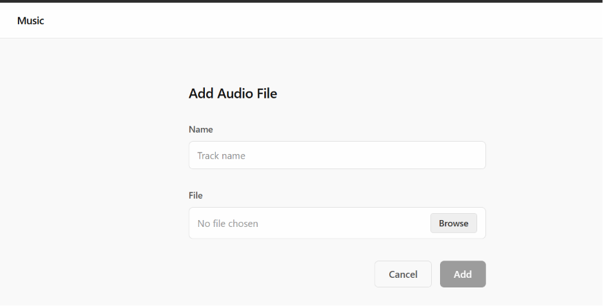
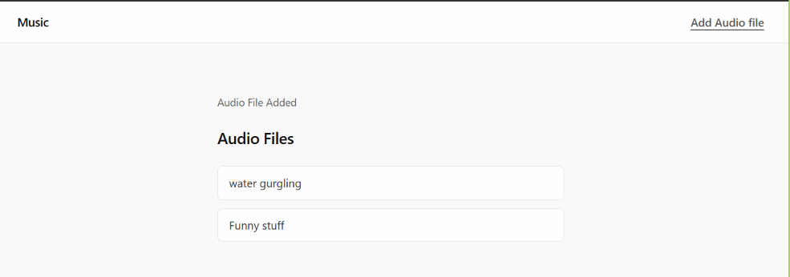

# Story-02: Add Audio Files

## User Story

**As a** Designer,
**I want** to add audio files
**so that** I can play music and build a playlist.

## Acceptance Criteria

- An audio file that has been downloaded can be added to the collection
- An added audio file is available to be played
- Added audio files are listed together after they are added

## Given / When / Then

Scenario: An audio file that has been downloaded can be added to the collection
**Given** there is an audio file on my desktop as an mp3
**When** I add that audio file to the system
**Then** the audio file is available to be played.

Scenario: An added audio file is available to be played
**Given**  audio file is in the system 
**When** I browse audio files
**Then** I am shown that the file exists.

Scenario: Added audio files are listed together after they are added
**Given** I have added one or more audio files
**When** I browse audio files
**Then** I am shown that all the audio files exist.

## UI Mockup

### Main Screen

Add Audio file in navbar



### Add Audio Page

```
Name: __________

File: [BROWSE]

_CANCEL_  _ADD_
```

### Confirmation/ audio files Page


```
Audio File complete

Audio Files:

File 1

File 2
```
